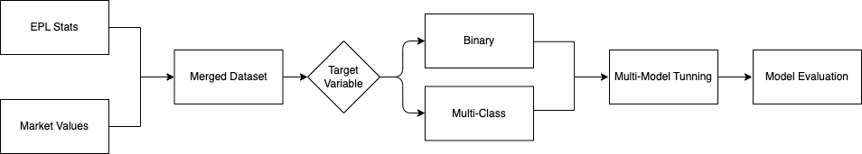
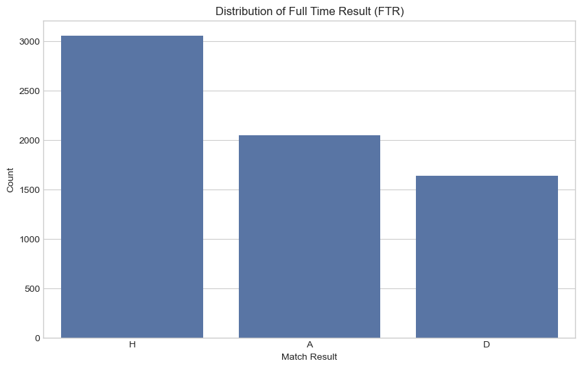
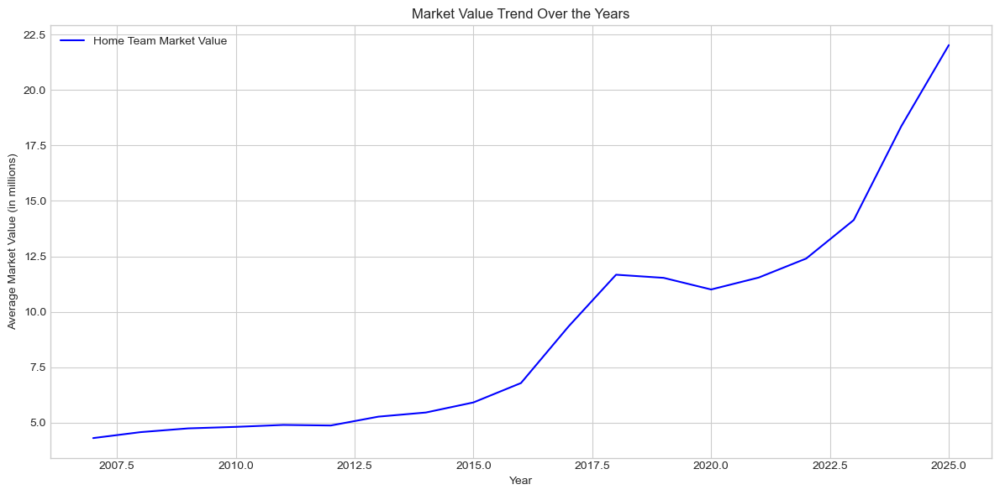
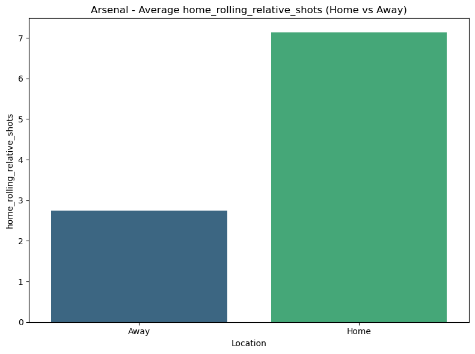
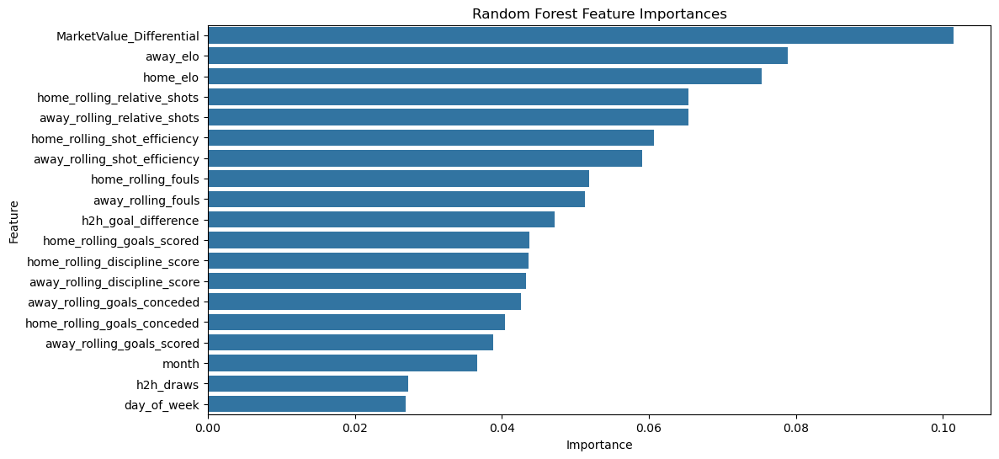
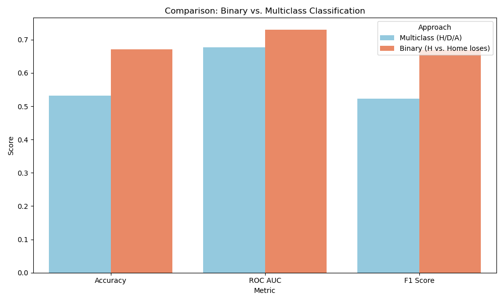
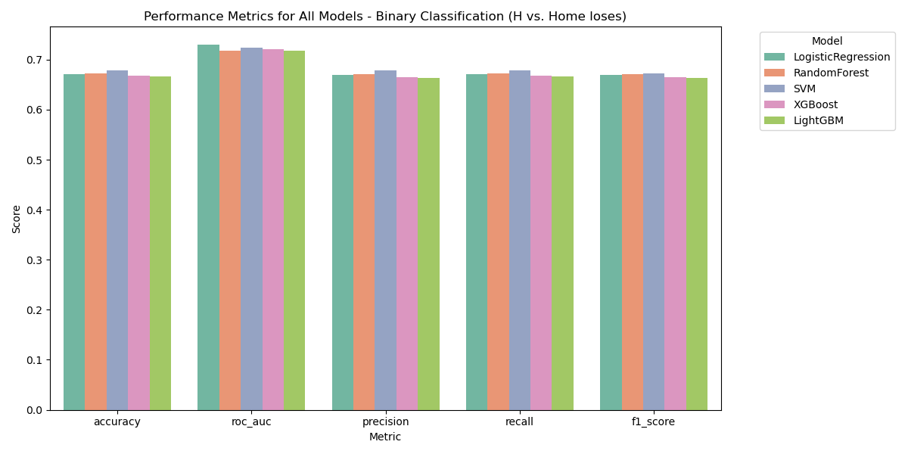
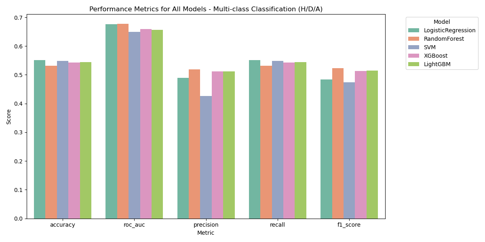

# ⚽ English Premier League Match Outcome Predictor

> *Predicting match results with feature-rich, time-aware machine learning pipelines.*

---

## 🚀 Overview

This project presents a robust machine learning pipeline for predicting English Premier League (EPL) match outcomes using historical data spanning the 2007 to 2024 seasons. Integrating match statistics from [Football-Data.co.uk](https://www.football-data.co.uk) and financial insights from [Transfermarkt](https://www.transfermarkt.com), this pipeline combines rigorous data engineering, domain-specific features, and model experimentation to identify patterns in team performance.

📁 The project is structured into:

- **Jupyter Notebooks**  
  - `01_preprocessing.ipynb`: Data cleaning and merging  
  - `02_feature_engineering.ipynb`: Feature construction and selection  
  - `03_modeling.ipynb`: Model training, evaluation, and interpretation

- **Python Scripts**  
  - `transfermarkt_scraper.py`  
  - `match_stats_scraper.py`

> 

---

## 🧹 Data Preprocessing

The preprocessing phase established a consistent, analysis-ready dataset by merging match stats (6750 rows × 166 columns) with team market valuations (360 rows × 3 columns). Critical steps included:

### 🔧 Key Tasks

- **Data Merging**: Unified match statistics and financial valuations on normalized team names and seasons.
- **Cleaning**: Removed post-match features and unreliable betting odds. 
- **Formatting**: Standardized dates, monetary formats, and team names via fuzzy matching.
- **Initial Feature Creation**: Engineered pre-modeling variables like market value for home/away teams.

> 
> 

### 🧠 Early Insights

- Home teams win ~50% of matches — confirming the long-standing "home advantage."
- Team market values have risen sharply, indicating increased financial investment.
- Shots on target and goals remain top predictive signals.

The resulting dataset (6749 rows × 21 columns) formed a clean foundation for deeper feature engineering.

---

## 🧠 Feature Engineering

A wide range of domain-driven features were engineered to capture match context, momentum, and structural differences between competing teams.
> 

### 🔍 Feature Categories

| Category | Description |
|---------|-------------|
| **Rolling Metrics** | Goals scored/conceded, shot efficiency over recent matches |
| **Dominance Indicators** | Shot and corner differentials |
| **Discipline Metrics** | Unified scores for yellow/red cards |
| **Temporal Context** | Day of week, month |
| **Elo Ratings** | Dynamic strength estimates updated after each match |
| **Head-to-Head History** | Wins, draws, and goal differences between teams |
| **Financial Differential** | Difference in team market valuations |

### Correlation Analysis
- Strong correlations between yellow cards and discipline score (**home: 0.95**, **away: 0.93**) indicated redundancy. **home_rolling_yellow_cards** and **away_rolling_yellow_cards** were dropped and retained discipline score for better clarity.

### 🔬 Consolidation & Selection

- Redundant features were dropped after multicollinearity checks using Pearson correlation and VIF scores.
- Final dataset retained 22 features (18 engineered, 4 structural) that offered both expressiveness and interpretability.

---

## 📉 Multicollinearity & Feature Refinement

To avoid inflated variance and spurious correlations:

- **Before Refinement**: Yellow and red cards exhibited perfect multicollinearity. Several head-to-head features had VIF > 10.
- **After Refinement**: Retained discipline scores (unified yellow/red), trimmed head-to-head features, and accepted moderate VIF values (4–7) for key predictors like market value differential.

### 🔥 Feature Importance (Top Predictors)

| Type | Feature | Importance Score |
|------|---------|------------------|
| Team Strength | Market value differential | 0.101 |
| Rolling Form | Relative shots, shot efficiency | 0.059–0.065 |
| Elo Ratings | Home & away teams | 0.075–0.079 |
| Contextual | Head-to-head goal diff, month, weekday | 0.027–0.047 |
| Discipline | Discipline scores | 0.043 |

> 

---

## 🧪 Modeling

The final phase explored two problem formulations:

1. **Multi-class Classification** (original):
   - Labels: `H` (home win), `D` (draw), `A` (away win)
2. **Binary Classification** (reformulated):
   - Labels: `1` (home win), `0` (draw or away win)

### 🛠 Implementation Details

- Introduced a flexible label transformation utility.
- Evaluated models using accuracy, F1 score, and ROC AUC.
- Created a unified pipeline to compare multi-class vs. binary setups.

```python
def run_epl_prediction(csv_path, run_original=True, run_binary=True):
    """
    Run the EPL match prediction pipeline with options for original and binary target
    
    Args:
        csv_path: Path to the CSV data file
        run_original: Whether to run the original 3-class model (H/D/A)
        run_binary: Whether to run the binary model (H vs. Home loses)
    """
```

### 🔥 Model Performance Comparison

| Task          | Best Model          | Accuracy | ROC AUC | F1 Score |
|---------------|---------------------|----------|---------|----------|
| Multi-class   | Random Forest       | 53.19%   | 0.677   | 0.523    |
| Binary        | Logistic Regression | 67.04%   | 0.729   | 0.669    |

>

> 

> 

🧠 Insights
- Binary formulation outperformed multi-class by 14% in accuracy and 5% in ROC AUC.

- Draws are fundamentally unpredictable — multi-class models predicted only ~1% of them correctly.

- Probability outputs from models offer nuanced insights valuable for betting or decision support.

🧭 Key Takeaways
- Time-Aware Engineering: No data leakage — all features use strictly past data only.

- High Signal Features: Market value, relative shots, and rolling performance metrics are consistently predictive.

- Binary Framing Advantage: Significantly more stable and accurate than multi-class prediction.

- Modular Pipeline: Easy to experiment with feature sets, model types, and evaluation metrics.


## 📂 File Structure

```
📂 Project Directory Structure

The repository is organized as follows:


EPL_Match_Outcome_Predictor/
├── data/
│   ├── raw/                            # Original datasets (e.g., match stats, financial data)
│   └── processed/                      # Processed datasets with engineered features (e.g., epl_engineered_filtered.csv)
├── Images/                             # Visualizations and output images used in the project
├── Model/                              # Saved models, encoders, and related artifacts
├── notebooks/
│   ├── 01_preprocessing.ipynb          # Data cleaning and merging
│   ├── 02_feature_engineering.ipynb    # Feature construction and selection
│   └── 03_modeling.ipynb               # Model training, evaluation, and interpretation
├── Results                             # Model performance output in csv for Binary and Multi-class 
├── Utilities/
│   ├── transfermarkt_scraper.py        # Script for scraping financial data from Transfermarkt
│   └── match_stats_scraper.py          # Script for scraping match statistics
├── note.txt                            # Stat abbreviations
├── README.md                           # Project documentation
├── requirements.txt                    # Required Libraries
```


## 📌 Future Directions

### 🔍 Feature Expansion
- **Player-Level Features**: Incorporate player statistics such as form, fitness, and individual contributions to team performance.
- **Team Injuries**: Factor in the impact of key player absences on match outcomes.
- **Betting Odds**: Integrate pre-match betting odds to enhance predictive accuracy.
- **Fan Sentiment Analysis**: Leverage social media and fan sentiment data to capture psychological and contextual factors.

### 🎯 Probabilistic Modeling
- **Calibrated Outputs**: Develop models that provide well-calibrated probability scores for confidence-based decision-making.
- **Uncertainty Quantification**: Explore Bayesian approaches to quantify prediction uncertainty and improve interpretability.

### 🧠 Team-Aware Models
- **Team Embeddings**: Use advanced techniques like embeddings to learn team-specific patterns and dynamics.
- **Dynamic Models**: Incorporate temporal changes in team strength, tactics, and form for more adaptive predictions.

### 🌐 Live Deployment
- **Interactive Dashboards**: Build a Streamlit or Dash application for real-time predictions and visualizations.
- **Betting Strategy Tool**: Develop a tool to assist users in optimizing betting strategies based on model outputs.
- **API Integration**: Create an API for seamless integration with third-party applications or platforms.

### 🚀 Additional Directions
- **Class Imbalance Handling**: Address class imbalance using oversampling, SMOTE, or class weighting techniques.
- **Ensemble Modeling**: Experiment with ensemble methods like stacking or boosting to improve predictive performance.
- **Player Availability**: Extend the pipeline to include real-time updates on player availability and tactical adjustments.
- **Global Expansion**: Adapt the pipeline for other leagues or tournaments to broaden its applicability.

By pursuing these directions, the project can evolve into a comprehensive, real-time decision support system for football analytics and beyond.


## 🏟️ Real-World Applications

This project has practical applications across various domains, including:

### 🎲 Betting Strategies
- **Informed Decision-Making**: Use model predictions to identify high-probability outcomes and optimize betting strategies.
- **Risk Management**: Leverage probabilistic outputs to assess confidence levels and minimize losses.
- **Market Insights**: Analyze trends in team performance and financial metrics to uncover undervalued opportunities.

### 📊 Team Performance Analysis
- **Strategic Planning**: Provide teams with insights into their strengths, weaknesses, and areas for improvement.
- **Opponent Analysis**: Evaluate upcoming opponents based on historical performance, financial strength, and momentum metrics.
- **Seasonal Trends**: Track team progress over time to inform tactical adjustments and resource allocation.

### 🧠 Sports Analytics
- **Broadcast Enhancements**: Integrate predictions and key metrics into live commentary or pre-match analysis.
- **Player Scouting**: Extend the pipeline to include player-level features for recruitment and talent identification.

### 💻 Decision Support Tools
- **Interactive Dashboards**: Deploy predictions and visualizations in a user-friendly interface for analysts and enthusiasts.
- **Real-Time Updates**: Adapt the pipeline for live match data to provide up-to-date predictions and insights.
- **Customizable Models**: Allow users to experiment with different features and models to suit specific needs.

### 🌍 Broader Implications
- **Financial Modeling**: Use market value trends to study the economic impact of investments in football.
- **Educational Use**: Serve as a case study for teaching machine learning, data engineering, and sports analytics.


By bridging data science and football, this project demonstrates the potential of machine learning to transform how we understand and interact with the beautiful game.
